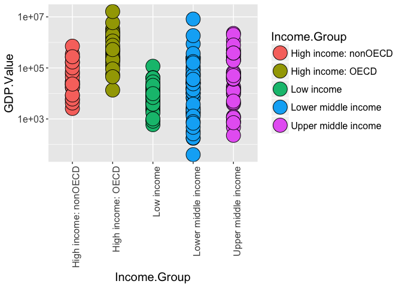

CaseStudy1Makefile
================
Jonathan Knowles, Nadia Green, Michael Crowder
March 20, 2017

Introduction
============

#### We want to look at data that relates Gross Domestic Product and involvement in the Organization for Economic Cooperation and Development (OECD) for more information on the OECD please visit \[<https://usoecd.usmission.gov/mission/overview.html>\]. What we find from the below acquisition, cleaning and analysis of the data is that there appears to be some relationship to being a member country of the OECD and increased GDP. Below we have included the source of the information we used, the methods used to clean and tidy the data and our answers to case specific questions.

#### Install Packages and Load Libraries - if you already have these Packages installed and loaded you may skip this step.

``` r
source("InstallPackagesLoadLibraries.R", print.eval = TRUE)
```

    ## 
    ## The downloaded binary packages are in
    ##  /var/folders/wz/910_s_x97vs8hrw8gnjc98g80000gn/T//RtmpfSN2Lp/downloaded_packages
    ## 
    ## The downloaded binary packages are in
    ##  /var/folders/wz/910_s_x97vs8hrw8gnjc98g80000gn/T//RtmpfSN2Lp/downloaded_packages
    ## 
    ## The downloaded binary packages are in
    ##  /var/folders/wz/910_s_x97vs8hrw8gnjc98g80000gn/T//RtmpfSN2Lp/downloaded_packages
    ## 
    ## The downloaded binary packages are in
    ##  /var/folders/wz/910_s_x97vs8hrw8gnjc98g80000gn/T//RtmpfSN2Lp/downloaded_packages
    ## 
    ## The downloaded binary packages are in
    ##  /var/folders/wz/910_s_x97vs8hrw8gnjc98g80000gn/T//RtmpfSN2Lp/downloaded_packages
    ## 
    ## The downloaded binary packages are in
    ##  /var/folders/wz/910_s_x97vs8hrw8gnjc98g80000gn/T//RtmpfSN2Lp/downloaded_packages
    ## 
    ## The downloaded binary packages are in
    ##  /var/folders/wz/910_s_x97vs8hrw8gnjc98g80000gn/T//RtmpfSN2Lp/downloaded_packages
    ## 
    ## The downloaded binary packages are in
    ##  /var/folders/wz/910_s_x97vs8hrw8gnjc98g80000gn/T//RtmpfSN2Lp/downloaded_packages
    ## 
    ## The downloaded binary packages are in
    ##  /var/folders/wz/910_s_x97vs8hrw8gnjc98g80000gn/T//RtmpfSN2Lp/downloaded_packages
    ## 
    ## The downloaded binary packages are in
    ##  /var/folders/wz/910_s_x97vs8hrw8gnjc98g80000gn/T//RtmpfSN2Lp/downloaded_packages
    ## 
    ## The downloaded binary packages are in
    ##  /var/folders/wz/910_s_x97vs8hrw8gnjc98g80000gn/T//RtmpfSN2Lp/downloaded_packages

    ## Warning: package 'Rcurl' is not available (for R version 3.3.2)

    ## Warning: Perhaps you meant 'RCurl' ?

    ## 
    ## The downloaded binary packages are in
    ##  /var/folders/wz/910_s_x97vs8hrw8gnjc98g80000gn/T//RtmpfSN2Lp/downloaded_packages
    ## 
    ## The downloaded binary packages are in
    ##  /var/folders/wz/910_s_x97vs8hrw8gnjc98g80000gn/T//RtmpfSN2Lp/downloaded_packages

#### Gathering the data with the below code allows us to download the data from the below websites and stores them in your current directory on R.

``` r
source("GatherData.R", print.eval = TRUE, echo = TRUE)
```

    ## 
    ## > gdpURL <- "https://d396qusza40orc.cloudfront.net/getdata%2Fdata%2FGDP.csv"
    ## 
    ## > eduURL <- "https://d396qusza40orc.cloudfront.net/getdata%2Fdata%2FEDSTATS_Country.csv"
    ## 
    ## > gdpFile <- tempfile()
    ## 
    ## > eduFile <- tempfile()
    ## 
    ## > download.file(gdpURL, gdpFile)
    ## 
    ## > download.file(eduURL, eduFile)

#### Cleaning the data by using easy to understand file names from a CSV format.

``` r
source("TidyAndCleanData.R", print.eval = TRUE, echo = TRUE)
```

    ## 
    ## > gdpData <- read.csv(gdpFile, skip = 5, nrows = 190, 
    ## +     stringsAsFactors = F, header = F)
    ## 
    ## > eduData <- read.csv(eduFile, stringsAsFactors = F)

#### Here we merge and futher tidy the data with human readable columns and set GDP as numeric.

``` r
source("MergeData.R", print.eval = TRUE, echo = TRUE)
```

    ## 
    ## > gdpData <- gdpData[, c(1, 2, 4, 5)]
    ## 
    ## > colnames(gdpData) <- c("CountryCode", "Rank", "Country.Name", 
    ## +     "GDP.Value")
    ## 
    ## > gdpData$GDP.Value <- as.numeric(gsub(",", "", gdpData$GDP.Value))
    ## 
    ## > matchedData <- merge(gdpData, eduData, by.x = "CountryCode", 
    ## +     by.y = "CountryCode")

#### In this section we answer the questions to the Case Study.

##### 1. We use the dim command to answer that we have matched *189 countries.*

##### 2. Using the arrange function which automatically sorts in ascending order we take our "Matched Data" and rank it looking for the 13th country which outputs as *Spain.*

##### 3. To find the average GDP ranking for the "High Income: OECD" and "High Income: nonOECD" groups we use the mean function as a subset of our MatchedData on the ranks for the two subsets to get the *average rank of 91.913 or 92.*

##### 4. For a visualization we use ggplot2 to create a dot plot by Income group. GDP Value is on a log 10 scale so to lessen the effect of outliers and help see the distribution of the Income Groups *See Graph Below*.

##### 5. There are 5 quantile groups we want to look at, specifically we want to find how many countries are in the Lower Middle Income but are part of the 38 nations with the highest GDP. For this we break our matchedData by rank into 5 groups and create breaks in the rankings. We then cut the breaks and place them into a table with the rows being our quantile groups and our columns the rankings to see how many countries fall into each category. *This puts 5 countries that fit into Lower Middle Income, but are amount the top 38 nations with the highest GDP.*

``` r
source("AnswerQuestions.R", print.eval = TRUE, echo = TRUE)
```

    ## 
    ## > dim(matchedData)
    ## [1] 189  34
    ## 
    ## > arrange(matchedData, Rank)[13, 3]
    ## [1] "Spain"
    ## 
    ## > mean(subset(matchedData, Income.Group %in% "High income: OECD", 
    ## +     select = c(Rank))$Rank)
    ## [1] 32.96667
    ## 
    ## > mean(subset(matchedData, Income.Group %in% "High income: nonOECD", 
    ## +     select = c(Rank))$Rank)
    ## [1] 91.91304
    ## 
    ## > ggplot(matchedData, aes(y = GDP.Value, x = Income.Group, 
    ## +     fill = Income.Group)) + scale_y_log10() + geom_point(pch = 21, 
    ## +     size = 8) + th .... [TRUNCATED]



    ## 
    ## > breaks <- quantile(matchedData$Rank, seq(0, 1, 0.2))
    ## 
    ## > head(cut(matchedData$Rank, breaks = breaks))
    ## [1] (152,190]   (76.2,114]  (38.6,76.2] (114,152]   (1,38.6]    (1,38.6]   
    ## Levels: (1,38.6] (38.6,76.2] (76.2,114] (114,152] (152,190]
    ## 
    ## > matchedData$quantile <- cut(matchedData$Rank, breaks = breaks)
    ## 
    ## > table(matchedData$Income.Group, matchedData$quantile)
    ##                       
    ##                        (1,38.6] (38.6,76.2] (76.2,114] (114,152] (152,190]
    ##   High income: nonOECD        4           5          8         4         2
    ##   High income: OECD          17          10          1         1         0
    ##   Low income                  0           1          9        16        11
    ##   Lower middle income         5          13         11         9        16
    ##   Upper middle income        11           9          8         8         9

Conclusion
----------

##### Although we find some evidence of a relationship with membership in the OECD we must caution the reader that the OECD has only been around for 50 years. It takes many years and geopolitical stability to build the necessary political and physical infrastructure needed to build a strong and stable economy. When we take a step back and look at the horizon of history many of the countries involved in OECD have spent at times hundreds of years developing the necessary political and physical infrastructure to participate and prosper in a global economy.
