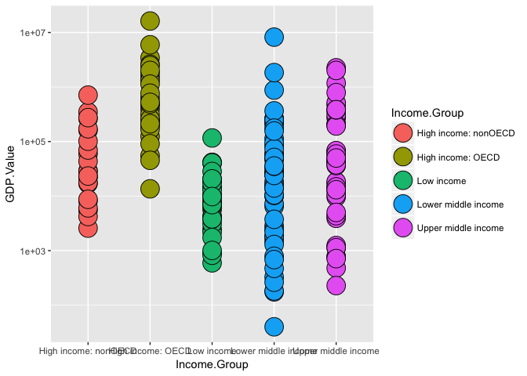

Case Study One
================
Michael Crowder
3/20/2017

-   [Case Study One](#case-study-one)
    -   [By: Michael Crowder, Nadya Green & Jonathan Knowels](#by-michael-crowder-nadya-green-jonathan-knowels)
    -   [**Introduction**](#introduction)

Case Study One
==============

### By: Michael Crowder, Nadya Green & Jonathan Knowels

Date: 20 March, 2017
output: github\_document

### **Introduction**

##### We want to look at data that relates Gross Domestic Product and involvement in the **Organization for Economic Cooperation and Development (OECD)** for more information on the OECD please visit \[<https://usoecd.usmission.gov/mission/overview.html>\]. What we find from the below acquisition, cleaning and analysis of the data is that there appears to be some relationship to being a member country of the OECD and increased GDP. With that said we must caution the reader that the OECD has only been around for 50 years. It takes many years and geopolitical stability to build the necessary political and physical infrastructure needed to build a strong and stable economy. When we take a step back and look at the horizon of history many of the countries involved in OECD have spent at times hundreds of years developing the necessary political and physical infrastructure to participate and prosper in a global economy. Below we have included the source of the information we used, the methods used to clean and tidy the data and our answers to case specific questions. The below code was written in R.

##### Install the following packages for this case study *if needed*

``` r
#install.packages("knitr")
#install.packages("markdown")
#install.packages("downloader")
#install.packages("lattice")
#install.packages("survival")
#install.packages("Formula")
#install.packages("ggplot2")
#install.packages("Hmisc")
#install.packages("repmis")
#install.packages("bitops")
#install.packages("Rcurl")
#install.packages("plyr")
#install.packages("reshape2")
```

##### Load libraries needed for this case study

``` r
library(knitr)
library(markdown)
library(downloader)
library(lattice)
library(survival)
library(Formula)
library(ggplot2)
library(Hmisc)
library(repmis)
library(bitops)
library(RCurl)
library(plyr)
library(reshape2)
```

##### Gather data

``` r
gdpURL <- "https://d396qusza40orc.cloudfront.net/getdata%2Fdata%2FGDP.csv"
eduURL <- "https://d396qusza40orc.cloudfront.net/getdata%2Fdata%2FEDSTATS_Country.csv"
gdpFile <- tempfile()
eduFile <- tempfile()
download.file(gdpURL, gdpFile)
download.file(eduURL, eduFile)
```

#### Tidy and Clean the Data

``` r
gdpData <- read.csv(gdpFile, skip = 5, nrows = 190, stringsAsFactors = F, header = F)
eduData <- read.csv(eduFile, stringsAsFactors = F)
```

#### Bring In the Columns we Need

``` r
gdpData <- gdpData[, c(1, 2, 4, 5)]
```

#### Make The Columns Human Readable

``` r
colnames(gdpData) <- c("CountryCode", "Rank", "Country.Name", "GDP.Value")
```

#### Set GDP Value to Numeric

``` r
gdpData$GDP.Value <- as.numeric(gsub(",", "", gdpData$GDP.Value))
```

#### Merge the data based on country code

``` r
matchedData <- merge(gdpData, eduData, by.x = "CountryCode", by.y = "CountryCode")
```

#### Answer to question \#1 - Number of countries that match:

``` r
dim(matchedData)
```

    ## [1] 189  34

#### Answer to \#2 - Sort the data frame in desscending order, then What is the 13th country in the resulting data frame:

``` r
arrange(matchedData, Rank)[13, 3]
```

    ## [1] "Spain"

#### Answers to \#3 - 3 What are the average GDP rankings for the "High income: OECD" and "High income: nonOECD" groups?

##### High income: OECD

``` r
mean(subset(matchedData, Income.Group %in% "High income: OECD", select = c(Rank))$Rank)
```

    ## [1] 32.96667

##### High income: nonOECD

``` r
mean(subset(matchedData, Income.Group %in% "High income: nonOECD", select = c(Rank))$Rank)
```

    ## [1] 91.91304

#### Answer to question \#4

``` r
ggplot(matchedData,aes(y = GDP.Value, x =Income.Group, fill=Income.Group)) + scale_y_log10()+ geom_point(pch = 21, size = 8)
```



#### Answer to question \#5

``` r
breaks <- quantile(matchedData$Rank,seq(0, 1, 0.2))
head(cut(matchedData$Rank, breaks = breaks))
```

    ## [1] (152,190]   (76.2,114]  (38.6,76.2] (114,152]   (1,38.6]    (1,38.6]   
    ## Levels: (1,38.6] (38.6,76.2] (76.2,114] (114,152] (152,190]

``` r
matchedData$quantile<-cut(matchedData$Rank,breaks=breaks)
table(matchedData$Income.Group, matchedData$quantile)
```

    ##                       
    ##                        (1,38.6] (38.6,76.2] (76.2,114] (114,152] (152,190]
    ##   High income: nonOECD        4           5          8         4         2
    ##   High income: OECD          17          10          1         1         0
    ##   Low income                  0           1          9        16        11
    ##   Lower middle income         5          13         11         9        16
    ##   Upper middle income        11           9          8         8         9
